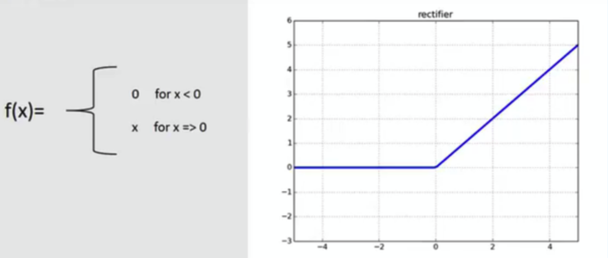

# Python and Basics Test for EVA5/EPAi
## by THE SCHOOL OF AI

***All questions carry 2 Points each.***

### **Test Questions - Part 1**

1. Assume this is a red image of 200x200 size. How many total pixels are there in this image?

- [ ] 20000 pixels
- [x] 40000 pixels
- [ ] 80000 pixels
- [ ] 120000 pixels

2. Consider a color image of size 100x100, which is completely white. If we were to convert this image into a numpy array and check the value of a random pixel (say at `[49, 99]`), the values we will see will be equal to:
- [ ] `[A, B, C]` where A, B and C will be equal 256, 256 and 256 respectively
- [x] `[A, B, C]` where A, B and C will be equal 255, 255 and 255 respectively
- [ ] `[A]` where A be equal to 255
- [ ] `[A, B, C]` where A, B and C could be any integer between 0-256

3. Solve:
```
    -9x + y = 18
    x + 2y = -19
```
- [ ] `(1, 27)`
- [x] `(-1, -9)`
- [ ] `(-9, -5)`
- [ ] `(0, 18)`
***All answers seems to be wrong***

4. Syntax error in python is detected by _______ at ____________
- [ ] programmer / fun time
- [ ] compiler / compile time
- [ ] compiler / run time
- [x] interpreter / run time

5. 
```
a = 0.1
b = 0.4
c = 0.3
d = b - c
print(a == d) #what does this print?
```
- [ ] SyntaxError: invalid syntax
- [ ] True
- [x] False
- [ ] NameError: name '`d`' is not defined

6. What unpacks the contents of a dictionary into the function call.
- [ ] `*`
- [ ] `%`
- [ ] `&`
- [x] `**`

7. Which of the following is a valid for loop in Python?
- [ ] `for a loop 3:`
- [x] `for a in range(1,3):`
- [ ] `for a in range(3)`
- [ ] `for(a = 0; a < 3; a++)`

8. Which of the following is a valid tuple in Python?
- [ ] `tup = 1, 2, 3`
- [x] `tup = (1, 2, 3)`
- [ ] `tup = 1, 'two', False`
- [x] `tup = (1, 'two', False)`

9. What is `(-13)%4`
- [ ] `1`
- [x] `3`
- [ ] `-3`
- [ ] `-1`

10. Consider this equation:
`y = a1*x1 + a2*x2 + c`
we want to calculate the rate of change (ROC) of y w.r.t `x1`. How will we circumvent the fact that the equation has `x2` as well, and `x1` might not be an independent variable? Consider all which apply.
- [x] ROC will only be valid for very small changes
- [x] We need to consider `x2` a constant to calculate ROC
- [ ] This problem cannot be solved
- [ ] We need to find out relationship between `x1` and `x2` first.

11. ReLU (a function we normally use in DNN) is defined as below. It should be clear from the formula and the graph, that ReLU is non-differentiable at 0. But we need fully differentiable functions during backpropagation or training. How do you think then we use ReLU?


- [ ] We forcefully make ReLU differentiable at 0.
- [ ] ReLU is already is differentiable at 0.
- [ ] We hope that we never have to calculate derivative of ReLU at 0.
- [x] We don't have to differentiate ReLU during training.

***All options seemed wrong to me***

12. What is the proper way to open a file that you intend to read from?
- [ ] `f = open(“r”,”file_name.txt”)`
- [x] `f = open(“file_name.txt”, “r”)`
- [ ] `f = open(“file_name.txt”, “read”)`
- [ ] `f = open(“read”,”file_name.txt”)`

13. What is the difference between a class and an object in Python?
- [ ] Objects are not able to be called.
- [ ] There is no difference between a class and an object
- [x] Objects are created from classes.
- [ ] Classes are made from iterations while objects are not.

14. Which one is NOT a legal variable name?
- [ ] `my_var`
- [ ] `myVar`
- [x] `my-var`
- [ ] `_myvar`

15. What is the output of the following code?
```
a = 123
b = 123
print((a == b), (a is b))
```
- [ ] True
- [ ] Error
- [x] True, True
- [ ] True, False
- [ ] BackNext


### **Test Questions - Part 2**

16. What is the output of the following code?
```
james = "james"
print(james*3)
```
- [ ] `jamesss`
- [x] `jamesjamesjames`
- [ ] `Error: invalid syntax`
- [ ] `james*3`

17. What is the output of the following code?
```
def calc(a, b = 5):
   print(a*b)
calc(1, 1)
```
- [ ] The program throws error
- [ ] 5
- [x] 1

18. What is the output of the following code?
```
sampleList = ["The", "School", "AI"]
sampleList.append(2, "Of")
print(sampleList)
```
- [ ] `['The', 'School', 'AI', 'Of']`
- [ ] `['The', 'Of', 'School', 'AI']`
- [ ] `['The', 'School', 'Of', 'AI']`
- [x] The program executed with errors

19. Can we use the “else” clause for loops? For instance:
```
for i in range(1, 5):
    print(i)
else:
    print("this is else block statement" )
```
- [ ] Sometimes
- [x] Yes
- [ ] No

20. What is the output of the following code?
```
tsai = "The School Of AI"
print(tsai[2::3])
```
- [x] ecoOA
- [ ] eSho fA
- [ ] eh A
- [ ] e School Of AI

21. What is the output of the following code?
```
var1 = 1
var2 = 2
var3 = "3"

print(var + var2 + var3)
```
- [ ] 33
- [x] `TypeError: can only concatenate str (not "int") to str`
- [ ] 6
- [ ] 123

22. The ‘`in`’ operator is used to check if a value exists within an iterable object container such as a list. Evaluates to true if it finds a variable in the specified sequence and false otherwise.

- [x] True
- [ ] False

23. A string is immutable in Python?
Every time when we modify the string, Python Always create a new String and assign a new string to that variable.
- [x] True
- [ ] False

24. What is the output of the following code?
```
x = 12
z = lambda y : y * x
print(z(2))
```
- [ ] 1212
- [x] 24
- [ ] Error

25. What is the output of the following code?
```
x = 5
x = [x**2 for x in range(1, x) if x%2 !=0]
print(x)
```
- [ ] `5`
- [ ] `[25, 25]`
- [x] `[1, 9]`
- [ ] `[4, 16]`

26. Suppose `list1 = [3, 4, 2, 1, 1, 5, 6, 1]`. What is list1 after `list1.pop(1)`?
- [ ] `[1, 3, 4, 2, 1, 1, 5, 6, 1]`
- [ ] `[3, 4, 2, 5, 6]`
- [ ] `[3, 4, 2, 1, 1, 5, 6]`
- [x] `[4, 2, 1, 1, 5, 6, 1]`

***Correct answer should be [3, 2, 1, 1, 5, 6, 1]***

27. Given a string `tsai = 'The School Of AI'`, which of the following code is incorrect?
- [ ] `tsai = 'The School of ML'`
- [x] `tsai[15:] = 'ML'`
- [ ] `print(tsai.lower())`
- [ ] `print(tsai[0])`

28. If you want to define a new kind of dnn layer, what would you use?
- [x] `torch.layer.dnn`
- [ ] `torch.nn.functional`
- [ ] `torch.layer`
- [ ] `torch.nn`

29. Which of these is not an activation function?
- [ ] RELU
- [ ] SGD
- [ ] SIGMOID
- [x] SELU

30. Input to a particular convolutional layer (L7) has size 56x56x256. If the next layer (L8) has 512 3x3 kernels, how many parameters are there in the L8
- [x] 802816
- [ ] 1179648
- [ ] 4608
- [ ] 1605632